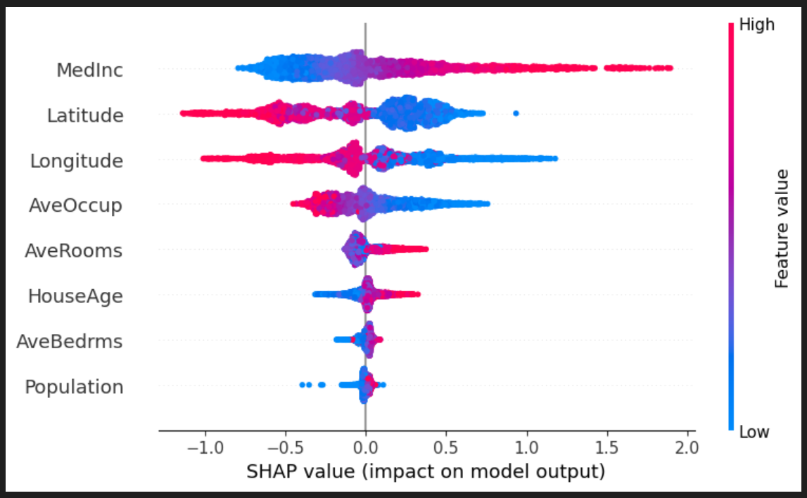
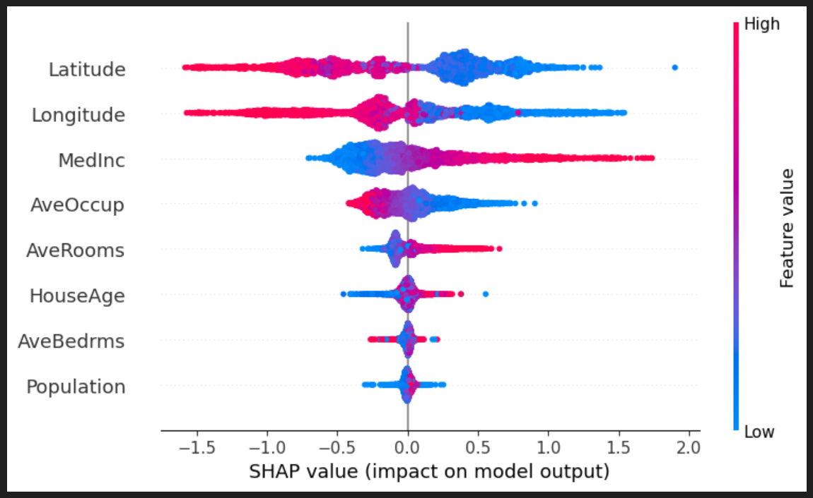
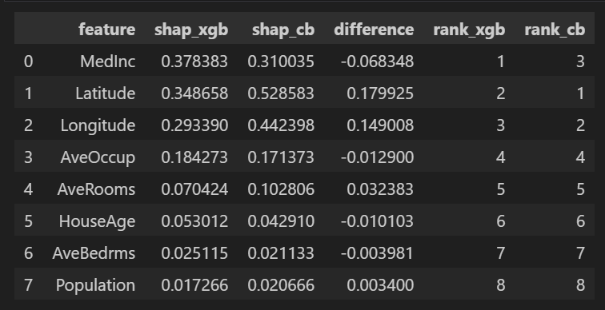
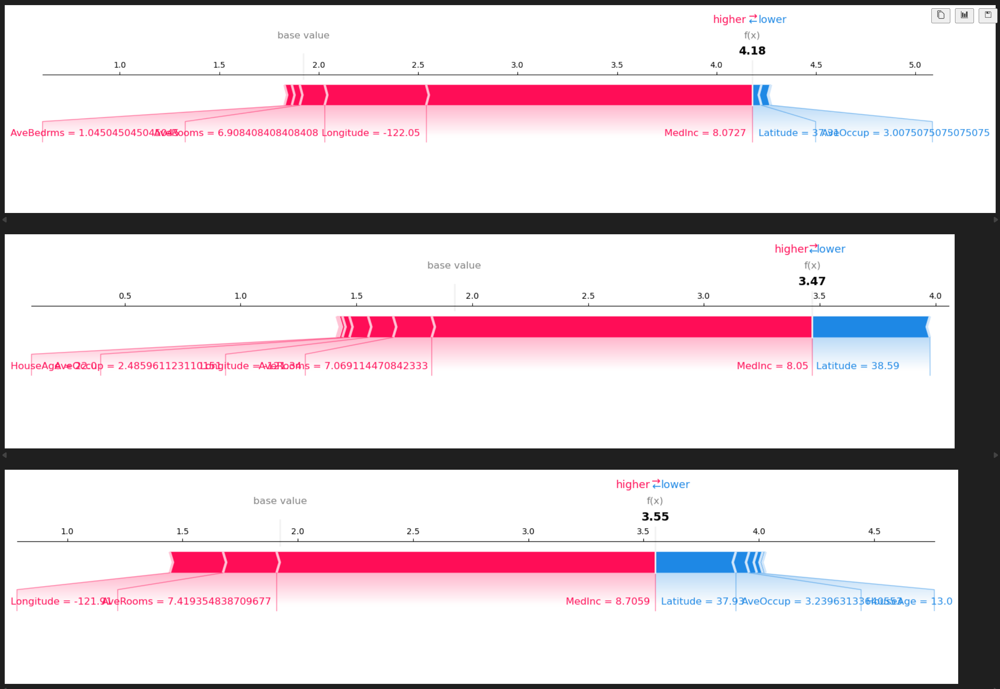
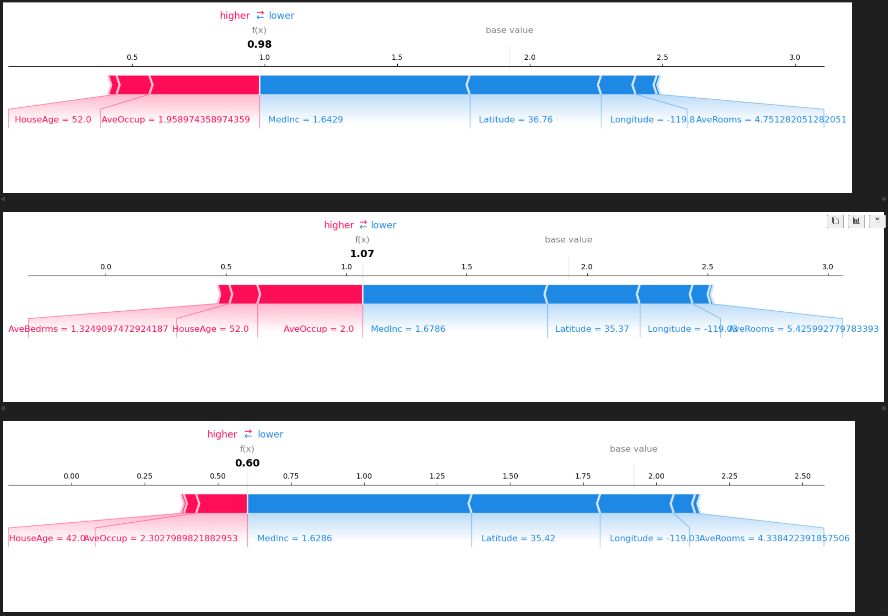

# California Housing – Machine Learning Regression Project

Main analysis notebook:
- [`notebooks/01_california_housing_ml.ipynb`](notebooks/01_california_housing_ml.ipynb)

This project builds a regression model to predict house prices in California
based on the classic *California Housing* dataset.

## Model comparison – XGBoost vs CatBoost (SHAP)

### SHAP summary – XGBoost

Poniższy wykres pokazuje globalny wpływ cech na wyjście modelu XGBoost
(wartości SHAP policzone na zbiorze testowym).



### SHAP summary – CatBoost

Analogiczny wykres dla finalnego modelu CatBoost.  
Widać, że oba modele zgadzają się co do kluczowych cech, ale CatBoost
nadaje większą wagę lokalizacji (Latitude, Longitude).



### SHAP – porównanie ważności cech (XGBoost vs CatBoost)

Tabela poniżej porównuje średnie bezwzględne wartości SHAP dla obu modeli
oraz ich rankingi.  
`shap_xgb` / `shap_cb` – globalny wpływ cechy wg SHAP,  
`rank_xgb` / `rank_cb` – pozycja cechy w danym modelu (1 = najważniejsza).




## Model explainability (SHAP)

### Feature importance (SHAP summary)


### Best positive prediction (highest SHAP contributions)


### Best negative prediction (lowest SHAP contributions)


### Example anomaly (largest prediction error)


## Project goals

- Exploratory Data Analysis (EDA) to understand the dataset.
- Data cleaning and preprocessing (missing values, scaling/encoding if needed).
- Training and comparison of several regression models:
  - baseline models,
  - Random Forest Regressor,
  - XGBoost Regressor.
- Evaluation with metrics: MSE, RMSE, R².
- Interpretation of feature importances and conclusions.

## Tech stack

- Python
- Jupyter Notebook
- pandas, numpy
- matplotlib, seaborn
- scikit-learn
- xgboost

## How to run

1. Create and activate a virtual environment (optional, but recommended).
2. Install dependencies:

   ```bash
   pip install -r requirements.txt

jupyter notebook

notebooks/01_california_housing_ml.ipynb

california-housing-ml/
├── notebooks/
│   └── 01_california_housing_ml.ipynb   # main analysis
├── requirements.txt                     # project dependencies
└── README.md                            # this file


---

### 3️⃣ Git lokalnie

W terminalu w katalogu `california-housing-ml`:

```bash
git init
git add .
git commit -m "Initial commit - California Housing ML project"
